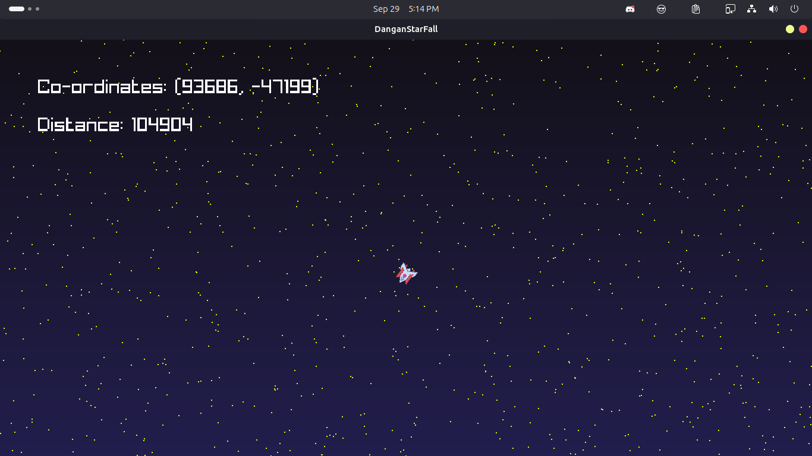

# Dangan Starfall
Dangan Starfall is a space shooter game set in the intense world of Danganronpa fan fiction, where players experience the thrill of surviving an execution. In this game, players not only battle through challenging space shooter trying survive the execution. Every character who participated in the killing game will be available for play, adding depth and variety to the experience which ofcourse, means that there will be twists in the gameplay for all characters. Creating a fresh experience DESPAIR of Danganronpa in a whole new way.

# Building from source.
Before speaking anything, here are the things you'll need to have installed.
- A C++ compiler
- Cmake
- Raylib installed
- Chipmunk Physics installed
- Discord rpc installed

## Windows
Not supported as the game is in alpha phase and will be supported soon after the game reaches a beta phase most likely.

## Linux
Also, on linux installing the above things would be pretty simple.\
Just install the libraries using your package manager. \
Although you might have to add repositories for some of them.\
Apart from the compiler that is, which is im pretty sure preinstalled in all distros.

## Android
I use raymob for compiling to android. which I haven't since I've integrated chipmunk as my physics engine. I'll compile to android once it reaches beta phase.